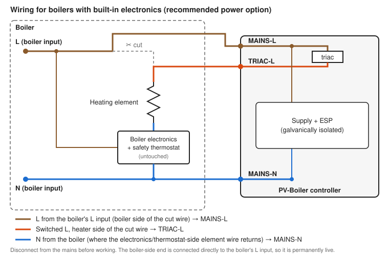

# Open-source ESP PV-Boiler Controller

> ⚠️ **WARNING: HAZARDOUS VOLTAGES**
>
> This project is provided "as-is" and is to be used entirely at your own risk! The hardware is connected to the mains and involves voltages that may be lethal. Only build, install and service it if you are qualified to work on mains equipment, and always disconnect it from the mains before opening the enclosure.
>
> - The ESP/low-voltage side of the controller is galvanically isolated from the mains. Nevertheless, treat everything as live and dangerous!
> - Mount the controller in a closed plastic enclosure and earth the heatsink properly to the mains ground.
> - Only connect the controller to a correctly fused circuit.
> - The boiler's own thermostat and thermal cutoff must remain in the heating circuit. This controller is not a substitute for over-temperature protection!

This project is a complete hardware, firmware & software solution to turn your "dumb" electronic domestic hot water boiler into a smart **PV-Boiler**. It aims to optimize the amount of surplus solar electricity that can be stored in a boiler as hot water using as little grid power as possible.

Most other solutions use SSR modules for power control. This design uses a (BTA25/BTA40) **triac** for power control to enable **phase-angle control**, which allows for more accurate power control than with a normal SSR.

The hardware was designed using **KiCAD**, and the software uses **MQTT** for communication, targeted to be used with **Home Assistant**. The hardware and firmware were developed for a NodeMCU v2 (Amica) ESP8266 module, but should in principle work with any ESP8266 or ESP32 board. Obviously, ESP boards with alternative form factors and/or pinouts cannot be directly fitted on the PCB but should be connected using wires, and you may need to modify platformio.ini and the GPIO definitions in include/system.h for your specific ESP board.

## Features

- Home Assistant (MQTT) support
- Phase angle control (default) or SSR dim style
- Configuration via USB serial connection or network terminal connection (port 8000)
- OTA updates (e.g. via PlatformIO)
- Operating modes: automatic power budget mode (using e.g. P1/HA information), (manual) power percentage mode, boost mode (100% power) and off mode. The mode can be dynamically changed using MQTT
- Support for an optional one-wire DS18B20 temperature sensor (probe) for sensing the boiler's internal temperature
- Automatic legionella prevention (using the external temperature sensor)
- Boiler overheating-protection (using the external temperature sensor) in case the boiler hardware thermostat somehow fails
- Temperature (thermostat) override function to allow setting a lower set-point from software than the one set on the boiler
- Support for an optional OLED 128×64 screen to display output power/percentage and connection status
- The controller has a network watchdog. If there hasn't been any MQTT traffic to the controller for a while (e.g. when the network fails), the output will automatically decrease to 0% instead of being stuck on the last value. This behaviour can be disabled/configured with the `netwdt` and `netwdr` commands.

## Planned features & improvements

- Improve control loop for budget logic mode
- Standalone support to directly interface with MQTT P1 providers like DSMR Reader
- New PCB design to fit a (dual-core) ESP32-DevKit module

## Known issues

- During development it turned out that due to the ESP8266's single-core architecture WiFi interferes with accurate interrupt timing, causing problems with zero-cross detection and triac gate firing. Mitigations are in place but they can't completely fix the issue. Therefore for new designs it's recommended to use an ESP board with a dual-core ESP32-S3, ESP32-WROOM or ESP32-Wrover. Note that single-core ESP32 variants (e.g. ESP32-C3, ESP32-S2) share the ESP8266's limitation.

## Electromagnetic compatibility

Phase-angle control inherently generates harmonics and electromagnetic interference, because the triac switches the load on part-way through each mains half-cycle. The design includes an RC snubber across the triac and a 2-stage mains filter to limit this. Although such mains filters are expensive, do not omit them: consider the filter mandatory. Depending on your country and installation, regulations on conducted emissions and flicker (e.g. the EN 61000-3 series in the EU) may still apply to the complete installation, so check them before putting the device into permanent use.

## Hardware Assembly Hints

1. In the pictures-folder of this project you can find photos of my assembled enclosure which can be used as a guideline to build your own device
2. Use a sufficiently sized heatsink with a little thermal compound for mounting the BTA-triac. Generally it is recommended to use a heatsink with a thermal resistance better than 1.0 °C/W when using a ~2500 W boiler. Don't forget to connect the heatsink to the mains ground for safety! You should also use triacs with an electrically insulated tab, like the BTA-type triacs in the design
3. Around some power traces the mask has been intentionally left out. You should solder these traces with extra solder to reduce the power losses due to trace resistance
4. It is recommended to use 1.5 mm² flexible wires for internal wiring
5. When using a one-wire DS18B20 temperature sensor (probe) there are a few things you must adhere to make it work properly. Its supply should be connected to the board's +5V (not +3.3V), and the cable's ground shield should be connected to the (digital) low-voltage ground (NOT the mains ground) of the board. Most (sealed) temperature probes use a metal probe housing which is connected to the cable shield. Since this may short to the mains ground and introduce (switching) noise into the system, it should be isolated. The easiest way to accomplish this is using some shrink-tube
6. The electronics are designed for ~230 VAC grids. For other (lower) grid voltages some resistors (R1, R2, R11) need to be modified
7. The controller can only be connected directly to the normal mains connections of "dumb" hot water boilers. Boilers featuring any kind of (digital) electronics (except for an analog thermostat) require a modification of the boiler's internal wiring, see [Boilers with built-in electronics](#boilers-with-built-in-electronics)

## Boilers with built-in electronics

For boilers with (digital) electronics the controller cannot be connected to the boiler's normal mains connections. Instead, the controller must be placed in series with the boiler's heating element. This requires modifying the boiler's internal wiring:

1. Disconnect the boiler from the mains and make sure it cannot be switched on accidentally.
2. Of the 2 wires of the (internal) heating element(s), identify the one that is connected to the (safety) thermostat. This wire, and therefore the thermostat, must remain untouched.
3. Cut the other wire (the one NOT connected to the thermostat) in two. Connect only the end that goes to the heating element to the controller's TRIAC-L terminal.
4. Power the controller in one of these ways:
   - **Recommended: from the cut wire.** Connect the other cut end (the one coming from the boiler) to the controller's MAINS-L terminal, and connect the controller's MAINS-N terminal to the boiler's N (the connection the thermostat-side element wire returns to). The controller then only needs this one additional N connection. Because the controller takes its L from the same wire that used to feed the element, the L/N polarity pitfall of the separate feed option is avoided, which makes this option much more fool-proof. The cut end goes directly to the boiler's L input and is therefore permanently live; verify this with a multimeter before connecting.
   - **Separate feed.** Connect the controller's MAINS-L and MAINS-N terminals to the boiler's mains L and N, and properly insulate the unused cut end. Make sure the boiler's mains L/N connections are such that the controller's MAINS-L is the same "L" that used to feed the cut wire. Otherwise you create a short between the mains N and L.

Things to be aware of:

- The separate feed option is only suitable for a fixed (hard-wired) installation with verified polarity. Do **not** use it with a reversible plug (e.g. Schuko) where L and N are undefined. Always verify L and N with a multimeter.
- The boiler's own electronics may react unexpectedly to the modification (e.g. by reporting a fault when the element is not powered). This is boiler-dependent.
- Modifying a boiler's internal wiring may void its warranty and, depending on your country, may need to be performed by a qualified electrician.

Only do this when you have sufficient confidence you understand what you are doing!

## First Time Use

1. Flash the ESP firmware using PlatformIO. The initial flash needs to be performed using the USB serial connection, with one of the `usb-xxxxx` (`usb-esp8266` or `usb-esp32`) PlatformIO-environments: `pio run -e usb-xxxxx -t upload`. You may need to customize `platform` and `board` in your `platformio.ini` for your specific ESP board first.
2. After the initial flash, future firmware updates can be done over-the-air (OTA) with one of the `ota-xxxxx` (`ota-esp8266` or `ota-esp32`) PlatformIO-environments: `pio run -e ota-xxxxx -t upload`. Note that you *may* need to substitute the controller's IP address for `pvboiler.local` in `upload_port` of the relevant `ota-xxxxx` environment in case mDNS is not available in your network (or it's failing somehow).
3. Connect to the microcontroller's terminal interface, either via the USB connection or a socket connection to the device's IP at port 8000, using a terminal program (e.g. PuTTY). The network terminal is plain-text and also gives access to the stored WiFi and MQTT credentials, so only use it on a network you trust.
4. In the command terminal, `help` (+ `Enter`) will show all available commands with their descriptions. Initially, these operations must be performed:
   - Reset all settings to default with the `factoryreset`-command.
   - Set your WiFi network SSID with the `ssid`-command, providing the name of your network as an argument.
   - Set your WiFi network password with the `pass`-command, providing your network's security password as an argument. You may provide a zero-length value when your network requires no password.
   - Set your MQTT server IP with the `serverip`-command, providing the server IP as an argument.
   - Set your MQTT server username with the `mqttuser`-command. You may provide a zero-length value when your server requires no username.
   - Set your MQTT server password with the `mqttpass`-command. You may provide a zero-length value when your server requires no password.
   - Set boiler power rating with the `boiler`-command, providing the power rating of your boiler as an argument (the factory default is 2500 W).

> **Notes**
>
> - Only change other settings when you understand what they do!
> - When using budget logic mode, you must regularly (at least at 5-second intervals is recommended) tell the PvBoiler controller how much "budget" (= excess solar PV electricity) is available, e.g. from Home Assistant. A sample automation for Home Assistant can be found in the `home assistant` folder.